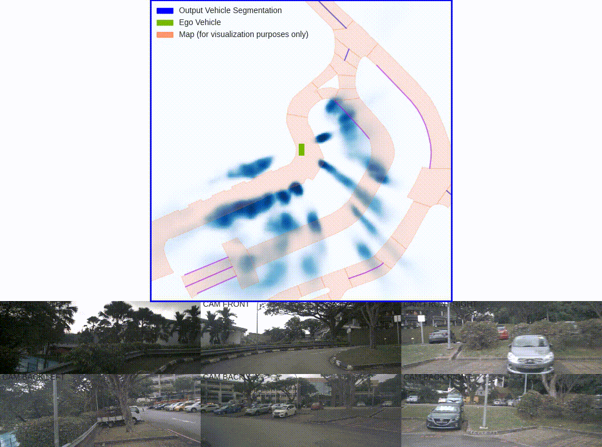
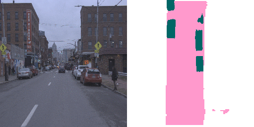
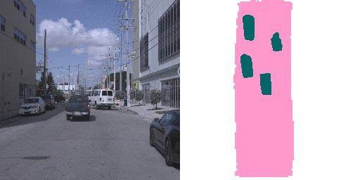
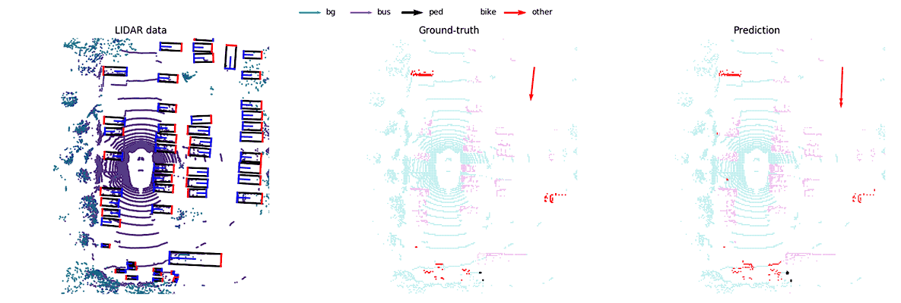

# Bird Eye View Networks (BEV-nets)

This repository containes forks of the SOTA works on local map construction for a mobile robot based on sensory input.
For relevant papers with code, please, refer to the [BEV-map construction notion section](https://www.notion.so/66d056f8ec984a4d8c179fbc232fac71?v=37b9a0485cd54d9f88fad8c2670f7af9).

## [Lift-Splat-Shoot](https://gitlab.com/vedu/bev-net/-/tree/master/lift-splat-shoot)
The end-to-end architecture that directly extracts a bird’s-eye-view semantic representation of a scene given image data from an arbitrary number of cameras.

## [Monolayout](https://gitlab.com/vedu/bev-net/-/tree/master/monolayout)
Given a single color image captured from a driving platform, the model predicts the bird's-eye view semantic layout of the road and other traffic participants.

| KITTI  | Argoverse |
|:------:|:---------:|
|
 
 | 

|
|

 | 

|

## [MotionNet](https://gitlab.com/vedu/bev-net/-/blob/master/motionnet-odom/motionnet.md)
Joint Perception and Motion Prediction for Autonomous Driving Based on Bird's Eye View Maps. In addition to semantic information, the model also predicts motion direction of
the cells on a local map based on sequence of lidar sweeps input.

